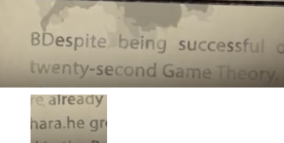

# D.Y5: Why You CAN'T Beat Super Smash Bros Ultimate!

On 10/16, a [video](https://www.youtube.com/watch?v=R2a6fnYOHVU) entitled "Game Theory: Why You CAN'T Beat Super Smash Bros Ultimate!" was posted to the main Game Theorists channel.
The video opens with MatPat mocking rabbit hole digging, probably in reference to the endless ability of people to look for clues where there aren't any.

At 13:55, a bottom third ticker during a "news segment" displays the text "Clues for the ARG continue to get leaked out in various episodes...but not this one" along with various Halloween-themed headlines.
This indicates that at least two clues \(note plural "clues"\) have been in at least two episodes \(note "various"\).
The implication that there are no clues in this episode is in and of itself a paradox as it is a clue indicating that there are no clues.
Logical fallacies amirite.

During one math calculation at 10:41, there is an "A" conspicuously added to the number.
This may be a typo.
The "A" is in the 21st place.

From 9:15 to 9:18, a graphic displays three segments of text which describe ancient civilizations then the history of Game Theory.
The text describing the Greeks was sourced from [Wikipedia](https://en.wikipedia.org/w/index.php?title=Portal:Ancient_Greece&oldid=854549996),
the English [translation](https://en.wikipedia.org/wiki/Lorem_ipsum#Latin_source) of lorem ipsum,
and [another site](https://www.ancient-greece.org/history/olympia.html);
the Romans from the [BBC](http://www.bbc.co.uk/history/ancient/romans/overview_roman_01.shtml);
and the Theorists from the [Game Theory Wikia](https://matpat.wikia.com/wiki/The_Game_Theorists?oldid=19282).
There seems to be two typos.
There is an added "B" at the beginning of a paragraph in the Theorists description, and a missing "T" in the BBC text.
The missing "T" is likely a typo as it is where a paragraph break used to be, so it would make sense if an editor hit backspace one too many times.

At 22:25, excerpts of C code and Japanese are seen on the screen.
These are both just Easter eggs.
The C code is from the Linux kernel and is commonly used as "hacker code" in movies.
The Japanese text "時間を無駄にしました" is loosely translated "you wasted your time".
